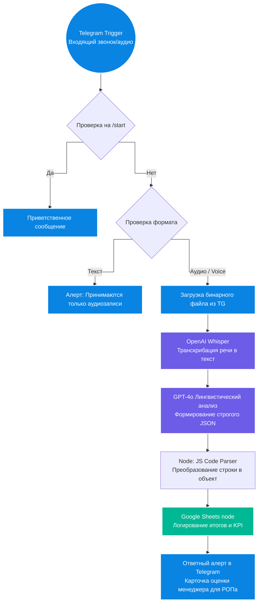

# 📊 AI-ОКК: Автоматизированный контроль качества отдела продаж на n8n

Комплексное решение для автоматического аудита телефонных разговоров и голосовых сообщений менеджеров по продажам. Система на базе n8n оркестрирует работу AI-моделей транскрибации и глубокого лингвистического анализа, оценивая работу сотрудников по 10 жестким коммерческим критериям.

## 🎥 Демонстрация работы инструмента
Ниже представлена подробная видеопрезентация работы разработанной системы автоматического контроля качества:

[видео презентация работы данного инструмента по ссылке https://drive.google.com/file/d/1pSzhd0YcShKvkW52UTP4ryC_Dp-EbEJS/view?usp=sharing

*(Вы можете запустить видео прямо здесь, чтобы увидеть путь файла от отправки в Telegram до анализа нейросетью и автоматического заполнения управленческой таблицы).*

## 💼 Бизнес-задача
* **Проблема:** Ручной контроль качества звонков (ОКК) занимает сотни человеко-часов. РОПы (руководители отделов продаж) физически успевают прослушать не более 5-10% от всех разговоров, из-за чего компания теряет прибыль на системных ошибках менеджеров (недожатые сделки, пропуск этапа выявления потребностей, плохая отработка возражений).
* **Решение:** Создан автономный AI-аудитор. Теперь 100% звонков проходят мгновенную проверку сразу после завершения разговора. Система выставляет честную оценку, выявляет слабые места и дает менеджеру персональные рекомендации для исправления ошибок.

## 🏗 Архитектура решения

Схема логики обработки аудиофайлов и генерации скоринга в n8n:

🧠 Логика ИИ-Анализа (10 KPI Продаж)
Аналитическая модель на базе gpt-4o оценивает диалог по 10 критериям по шкале от 0 до 10:

Приветствие и установление контакта (бодрость, представление, квалификация по имени).

Выявление потребностей (наличие открытых вопросов, определение "боли" клиента).

Презентация продукта (аргументация на основе потребностей, отсутствие "воды").

Работа с возражениями (эмпатичное принятие сомнений, аргументированное снятие страхов).

Закрытие сделки / Call to Action (наличие чёткого следующего шага и фиксации времени).

Вежливость и эмпатия (подстройка под тон гостя, вежливость).

Соблюдение структуры звонка (удержание инициативы, менеджер ведет диалог, а не клиент).

Активное слушание (запрет на перебивание, вербальное подтверждение понимания).

Чистота речи (отсутствие слов-паразитов, долгих пауз, мычания).

Инициатива (целенаправленное ведение клиента по воронке к покупке).

📝 Выходной формат данных (Парсинг JSON)
Модель возвращает РОПу и в базу данных структурированный объект, содержащий:

manager_name — автоматическое определение сотрудника.

summary — краткое содержание сути договоренностей.

examples — разбор ошибок в интерактивном формате БЫЛО: [цитата] → СТАЛО: [как правильно].

recommendations — 3 точечных совета для работы над ошибками.

total_score — математически точное среднее арифметическое всех 10 оценок.

🛠 Технологический стек
Оркестрация процессов: n8n Workflow

Речевые технологии (Speech-to-Text): OpenAI Whisper API

Аналитический ИИ-движок: GPT-4o (через LangChain компоненты n8n)

Интерфейсы ввода/вывода: Telegram Bot API

Хранилище данных и отчетность: Google Sheets REST API (v4)

Разработано архитектором AI-систем в рамках создания автоматизированных систем контроля качества (ОКК).
