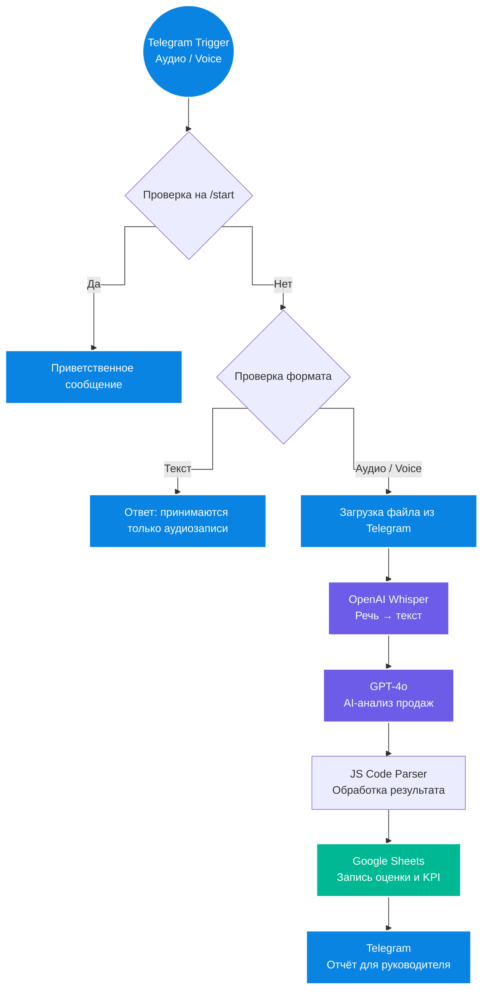

# 📊 AI-ОКК: автоматизированный контроль качества отдела продаж на n8n

**AI-ОКК** — это система автоматического анализа звонков и голосовых сообщений менеджеров по продажам.

Решение принимает аудиофайл через Telegram, переводит речь в текст, анализирует диалог с помощью AI, оценивает качество работы менеджера, сохраняет результат в Google Sheets и отправляет руководителю готовую карточку оценки.

Проект разработан как практический инструмент для руководителей отделов продаж, собственников бизнеса и команд, которым важно регулярно контролировать качество коммуникации менеджеров с клиентами.

---

## 🎥 Демонстрация работы

[видео_презентация_окк.mp4](видео_презентация_окк.mp4)

В видео показан полный путь обработки:

**Telegram → транскрибация → AI-анализ → оценка менеджера → Google Sheets → отчёт руководителю**

---

## 💼 Бизнес-проблема

Ручной контроль качества звонков занимает слишком много времени.

Руководитель отдела продаж физически не может прослушивать все разговоры менеджеров. Обычно проверяется только малая часть звонков, из-за чего системные ошибки остаются незамеченными.

Компания теряет деньги, когда менеджеры:

- не выявляют потребность клиента;
- слабо презентуют продукт;
- не отрабатывают возражения;
- не фиксируют следующий шаг;
- заканчивают разговор без продажи или договорённости;
- повторяют одни и те же ошибки от звонка к звонку.

---

## ✅ Что было реализовано

Разработан автоматический AI-аудитор отдела продаж.

Система проверяет разговоры без ручного прослушивания и формирует для руководителя понятный отчёт:

- кто из менеджеров общался с клиентом;
- о чём был разговор;
- насколько качественно прошёл диалог;
- какие ошибки допустил менеджер;
- как можно было ответить лучше;
- какие рекомендации стоит дать сотруднику.

Главная ценность решения — не просто в переводе речи в текст, а в создании инструмента управленческого контроля качества продаж.

---

## 🏗 Архитектура

📈 Результат для бизнеса

После внедрения система помогает компании перейти от выборочного ручного контроля к регулярному AI-аудиту коммуникаций.

Система позволяет:

проверять больше звонков и голосовых сообщений без увеличения нагрузки на руководителя;
экономить время руководителя отдела продаж;
быстро находить слабые места менеджеров;
обучать сотрудников на реальных ошибках из диалогов;
стандартизировать качество общения с клиентами;
отслеживать динамику работы менеджеров;
формировать прозрачную систему оценки качества продаж;
повышать конверсию отдела продаж за счёт регулярной обратной связи.
 🎯 Кому подходит решение

Решение подходит компаниям, где продажи, консультации или обработка заявок проходят через звонки и голосовые сообщения.

Может использоваться в:

отделах продаж;
call-центрах;
онлайн-школах;
клиниках;
салонах красоты;
туристических компаниях;
агентствах недвижимости;
автосалонах;
сервисных компаниях;
ресторанных и банкетных проектах;
SPA, фитнес и wellness-бизнесе;
компаниях с большим количеством входящих и исходящих звонков.
🛠 Технологический стек
Инструмент	Роль в проекте
n8n	Оркестрация всей автоматизации.
Telegram Bot API	Приём аудиофайлов и отправка отчётов руководителю.
OpenAI Whisper API	Перевод речи в текст.
GPT-4o	Анализ звонка, оценка менеджера и генерация рекомендаций.
LangChain-компоненты n8n	Работа с AI-моделью внутри workflow.
JavaScript Code Node	Обработка и подготовка результата.
Google Sheets API	Хранение оценок, KPI и управленческой отчётности.
👨‍💼 Об авторе

Проект разработан Равилем Муртазиным — специалистом по AI-автоматизации бизнес-процессов, внедрению чат-ботов, AI-воронок и систем контроля качества продаж.

Я занимаюсь созданием практических AI-решений для бизнеса: автоматизирую рутинные процессы, внедряю ИИ в продажи, клиентский сервис, аналитику и коммуникации.

Этот проект создан как пример того, как искусственный интеллект можно использовать для решения конкретной управленческой задачи — контроля качества работы отдела продаж.

Основные направления работы
AI-автоматизация бизнес-процессов;
чат-боты для продаж и клиентского сервиса;
AI-воронки и автоворонки;
автоматизация отделов продаж;
интеграции на базе n8n;
внедрение AI-аналитики;
системы контроля качества продаж;
Telegram-боты и WhatsApp-автоматизация;
интеграции с CRM и таблицами;
AI-инструменты для руководителей и собственников бизнеса.

📎 Статус проекта

Рабочий прототип автоматизированной системы AI-ОКК на базе n8n.

Решение может быть адаптировано под разные ниши, отделы продаж, критерии оценки и внутренние стандарты компании.
